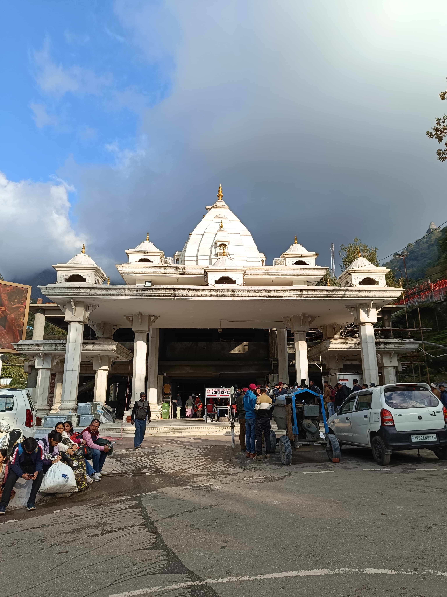
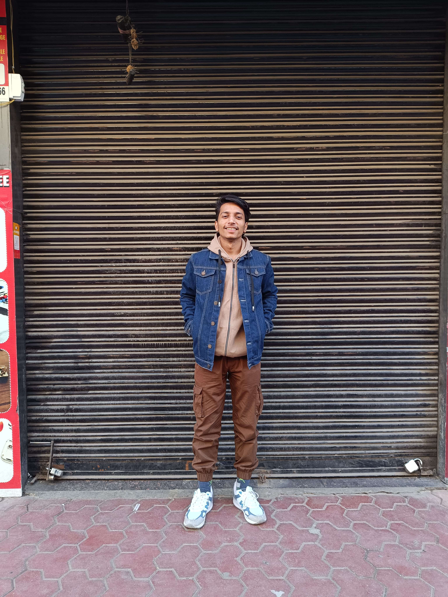

# Flam
 Seamlessly Integrating a Person into a Scene
# 🧠 Seamless Person Integration into a Scene

This project demonstrates a complete pipeline for integrating a person image into a background scene **realistically**, including **background removal**, **light direction analysis**, **shadow synthesis**, **color harmonization**, and **seamless compositing**.

---

## 📷 Final Result

  

---

## 🖼️ Inputs

| Background Scene                         
|--------------------------------|
|    

| foreground Scene                         
|--------------------------------|
|     

---

## 🎯 Objective

To place a person into a different background scene and seamlessly blend them in a **photorealistic** manner, preserving lighting and shadow context.

---

## 📌 Steps Followed

### 🧩 1. Person Image Capture & Preprocessing
- Captured high-resolution front-view image
- Removed background using `rembg`
- Resized the person image proportionally to fit the scene

### 🔦 2. Light Direction Estimation
- Estimated dominant light angle = **55.85°**
- Used this to inform shadow direction

### 🕶️ 3. Shadow Generation
- Generated a silhouette from the alpha mask
- Applied affine warp to simulate directional light
- Added Gaussian blur for soft falloff
- Lowered opacity for realism

### 🎨 4. Color Harmonization
- Used per-channel histogram matching
- Blended matched and original color with 70–80% ratio

### 🧵 5. Final Blending
- Composited shadow and person using alpha-aware paste
- Verified alignment and scale in final scene

---

## 🛠️ Tools & Libraries

- `Python 3`
- `OpenCV`
- `PIL (Pillow)`
- `NumPy`
- `rembg`
- `skimage.exposure.match_histograms`

---

## 🔍 Extra Steps Identified and Added

- Color harmonization using localized histogram matching
- Shadow softness control
- Alignment of shadow with foreground via affine transforms
- Alpha-preserving compositing

---

## ✅ Final Deliverables

- 📷 `images/result.png` — final composite
- 🖼️ `images/background.jpg` — scene
- 👤 `images/person_no_bg.png` — extracted person
- 📄 `README.md` — documentation of the algorithm and process

---

## 📬 Contact

Made as part of an AI Engineer assignment. Contributions welcome!
